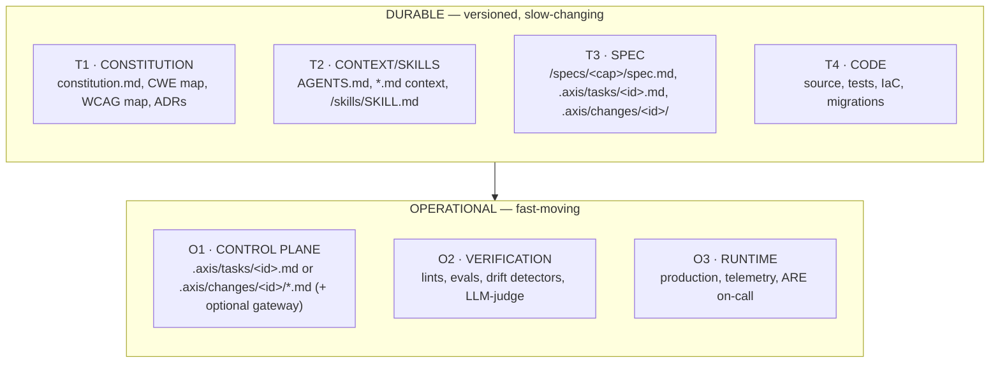
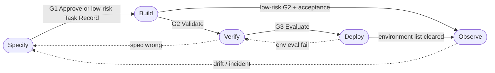
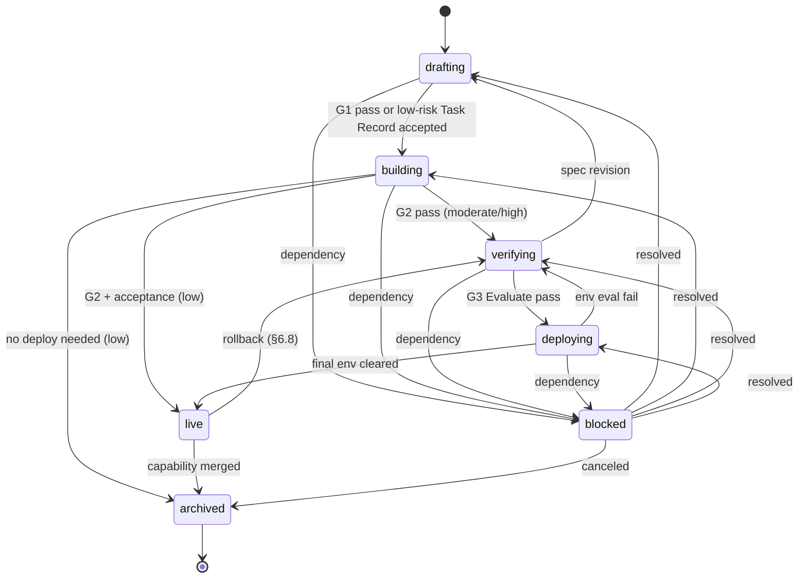
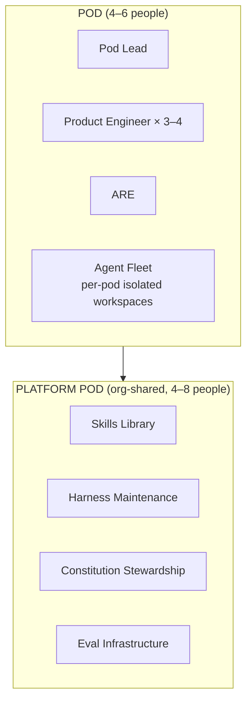

# AXIS-26: Agentic eXecutable Intent Specification

**Specification, Version 0.0.1**

---

## Status of This Document

This document is a public specification, version 0.0.1, released 2026-05-08. It is the initial public release of the AXIS-26 specification.

The specification text (this document) is licensed under **Creative Commons Attribution 4.0 (CC BY 4.0)**. The reference implementation in this repository is licensed under **Apache 2.0**.

Conformance to this specification is claimed at one of three tiers: **Minimal**, **Standard**, or **Full**. See §3.

The specification is versioned per semver. Errata, clarifications, and amendments follow the process in §9.

---

## Abstract

AXIS-26 is a software-delivery specification for the AI-first era. It defines a constitutional rule set, a five-phase lifecycle with three gates, three risk levels, a repository-canonical control plane, and a conformance test suite. Specifications are canonical; code is derived. Rigor scales with risk rather than uniform ceremony. Task state lives in version-controlled Markdown rather than a SaaS gateway. Three conformance tiers — Minimal, Standard, Full — let a solo developer and a thousand-engineer organization both legitimately claim adoption.

---

## Table of Contents

**Body (Normative)**

1. Introduction
2. Conventions and Terminology
3. Conformance
4. Constitution
5. Architecture
6. Process Model
7. Control Plane
8. Verification Model
9. Versioning and Governance
10. Security Considerations
11. References

**Appendices**

- A. Schemas (Normative)
- B. Reference Templates (Informative)
- C. Reference Skills and Hooks (Informative)
- D. Adoption and Migration (Informative)
- E. Worked Example (Informative)
- F. Comparison and FAQ (Informative)

Acknowledgments

---

# 1. Introduction

## 1.1 Background

Generation has scaled; verification has not. AI agents now author a substantial share of new code, but recent longitudinal studies report median throughput gains in the single digits — far below the 10× rhetoric — while parallel telemetry studies report sharp rises in incidents per PR as throughput rises (see [DX-AI] and [FAROS-2026] in §11.2). Methodologies built for the human-throughput era (uniform Scrum ceremony, velocity metrics) and methodologies built for the autonomous-agent vision (uniform spec rigor) both fail under agent acceleration. AXIS-26 specifies a middle path that scales rigor by risk rather than by policy.

## 1.2 Quick Start (Non-Normative)

Minimal AXIS-26 conformance is achievable in approximately two hours:

1. Place a Constitution at `constitution.md` (template in Appendix B.1).
2. Place an agent context file at `AGENTS.md` (template in Appendix B.2).
3. Place risk routing rules at `.axis/routing.yaml` (schema in Appendix A.1).
4. Author or bootstrap at least one skill under `/skills/<name>/SKILL.md`.
5. Run one real change through the lifecycle (§6.1) under `.axis/tasks/<id>.md` for low risk or `.axis/changes/<id>/` for moderate/high.

The repository now satisfies §3.1 (Minimal). Roll back at any time by deleting `constitution.md`, `AGENTS.md`, `.axis/`, and the bootstrapped `/skills/` entries.

## 1.3 Document Organization

The body of this document (§1–§11) is normative. The appendices are mixed: Appendix A is normative; B–F are informative. Examples shown inside the body are non-normative unless explicitly marked. References are split into Normative References (§11.1) and Informative References (§11.2) per RFC convention.

The reference repository ships several companion documents that are *not* part of this specification but are intended to travel with implementations: `README.md` (overview and on-ramp), `CONTRIBUTING.md` (operational details for §9.3), `CODE_OF_CONDUCT.md` (Contributor Covenant 2.1 per §9.3), `SECURITY.md` (GitHub-reserved vulnerability disclosure policy; see §2.4), `THREAT-MODEL.md` (engineering security architecture per §3.3 F1; see §2.4 for the SECURITY.md/THREAT-MODEL.md split), `CHANGELOG.md`, and `DISCLAIMER.md` (an explicit, non-normative "AS IS" disclaimer for the reference implementation, opinionated-synthesis caveat, and lack of regulatory pre-certification). None of these are required for conformance; they exist to make adoption auditable.

---

# 2. Conventions and Terminology

## 2.1 Notational Conventions

The keywords **MUST**, **MUST NOT**, **SHALL**, **SHALL NOT**, **REQUIRED**, **SHOULD**, **SHOULD NOT**, **RECOMMENDED**, **MAY**, and **OPTIONAL** in this document are to be interpreted as described in IETF RFC 2119 and RFC 8174 when, and only when, they appear in all capitals.

## 2.2 Terminology

| Term | Definition |
|---|---|
| **Constitution** | A versioned, machine-readable file (`constitution.md`) declaring the project's MUST/SHOULD/MAY rules. See §4. |
| **Risk** | One of three risk levels: low, moderate, or high. Each level prescribes a different rigor profile. See §6.3. |
| **Pod** | A team unit of 4–6 Product Engineers plus an Agentic Reliability Engineer (ARE). See Appendix D.1. |
| **Agent Fleet** | The collection of AI coding agents operating within a Pod's bounded scope, executing work in Specify, Build, and Verify phases under the Pod's direction. Agents in a fleet run in isolated workspaces, share the Constitution and AGENTS.md context, and consume the same skills library. Fleet management — capacity, identity, cost, runtime policy — is the ARE's responsibility. See §D.1. |
| **ARE** | Agentic Reliability Engineer. The role responsible for harness reliability, eval infrastructure, and drift detection — the SRE counterpart for an Agent Fleet. |
| **Change** | A single tracked unit of work at any risk level. (Sometimes abbreviated **UoW** — Unit of Work — in older literature.) |
| **MTTV** | Mean Time to Verification. For low risk, time from Task Record acceptance to G2 Validate pass; for moderate/high, time from G1 Approve to G3 Evaluate pass. |
| **MTTR** | Mean Time to Rollback. Time from rollback decision to rollback complete. See §6.8. |
| **Two-Key Approval** | A spec-approval rule (also: two-person rule, dual control, four-eyes principle) requiring two distinct individuals, typically in different roles, to each independently approve a change before it advances past G1. Mandatory at risk `high`. See §6.2. |
| **G1, G2, G3** | The three gates in the lifecycle: G1 Approve — spec approval; G2 Validate — deterministic artifact validation; G3 Evaluate — behavior plus constitution evaluation. See §6.2. |
| **Gate** | A predefined checkpoint in the lifecycle where specific criteria — measurable, codified, and observable — must be met before a change advances. AXIS-26 defines exactly three: G1, G2, G3. |
| **Specify, Build, Verify, Deploy, Observe** | The five lifecycle phases. See §6.1. |
| **Brownfield Delta** | A change expressed as ADDED/MODIFIED/REMOVED requirements against an existing capability spec. See §6.6. |
| **Skill** | A model-invoked instruction file conforming to the SKILL.md format. |
| **EARS** | Easy Approach to Requirements Syntax (Mavin et al., 2009). |
| **DX Core 4** | The four-dimension developer-productivity framework (Speed, Effectiveness, Quality, Impact) defined by DX in December 2024. |

## 2.3 Reserved Identifiers

The following identifiers are normative and reserved by this specification:

- The risk levels `low`, `moderate`, `high`.
- The status values `drafting`, `building`, `verifying`, `deploying`, `live`, `blocked`, `archived`.
- The phase names `Specify`, `Build`, `Verify`, `Deploy`, `Observe`.
- The gate IDs `G1`, `G2`, `G3` and display names `G1 Approve`, `G2 Validate`, `G3 Evaluate`.
- The directory `.axis/` at repository roots.
- The skill-name prefix `axis-` (e.g., `axis-lifecycle`, `axis-cwe`) and the plugin-package namespace `axis` — either the bare token (`axis`) or any name beginning with `axis-` (e.g., `axis-foo`, `axis-bar`) — in public marketplaces. The reference plugin uses the bare token `axis` so its slash commands resolve as `/axis:specify`, `/axis:build`, etc. (§2.4).

The body of artifacts (Constitution, AGENTS.md, skills, specs, change documents) MAY be authored in any natural language. Reserved identifiers MUST appear in their normative English form.

## 2.4 File and Naming Conventions

The following conventions are normative. Implementations MAY extend them but MUST NOT contradict them.

| Element | Convention | Examples |
|---|---|---|
| YAML keys | `snake_case` | `default`, `eval_threshold`, `require_two_key`, `auto_promote` |
| YAML enum values | `lowercase`, except canonical gate IDs `G1`, `G2`, `G3` | `low`, `moderate`, `high`, `drafting`, `live`, `G2` |
| Skill names | `kebab-case` | `ears-coach`, `cwe-scanner`, `risk-router` |
| Slash commands | `<plugin>:<verb>` | `/axis:specify`, `/axis:build`, `/axis:deploy` |
| Hook script files | `kebab-case`, `.sh` extension | `pre-tool-use-cwe.sh`, `stop-eval-gate.sh` |
| Plugin package names | `kebab-case`, in the `axis` namespace per §2.3 | `axis` (reference plugin), `axis-method` (marketplace), `axis-foo` (extension plugin) |
| Top-level governance files | `ALL-CAPS.md` (or `LICENSE` no extension) | `README.md`, `LICENSE`, `CONTRIBUTING.md`, `CODE_OF_CONDUCT.md`, `CHANGELOG.md`, `AGENTS.md` |
| Top-level engineering context files (F1) | `ALL-CAPS.md` | `PRODUCT.md`, `DESIGN.md`, `BACKEND.md`, `INFRA.md`, `THREAT-MODEL.md`, `DOMAIN.md`, `RUNBOOK.md` |
| Project-artifact files | `lowercase.md` | `constitution.md`, `proposal.md`, `delta.md`, `design.md`, `tasks.md`, `spec.md` |
| Tool-config directories | `.<name>/` (hidden) | `.axis/`, `.github/`, `.agents/`, `.claude-plugin/`, `.codex-plugin/`, `.cursor/` |
| Tool-config files | `lowercase.yaml` or `lowercase.json` | `routing.yaml`, `sync.yaml`, `plugin.json`, `.mcp.json` |
| Record IDs | `YYYY-MM-NNN-<slug>` | `2026-05-007-gdpr-export` |
| AP IDs | `AP-NNNN-<slug>` | `AP-0042-rollback-cascade` |
| AP filenames | `AP-NNNN-<slug>.md` | `AP-0042-rollback-cascade.md` |
| Gate evidence files | `<gate-id>-<gate-action>-<artifact-kind>.<ext>` | `g1-approve.md`, `g2-validate-report.json`, `g3-evaluate-report.json` |
| Lifecycle record files | `<event-or-condition>-record.md` | `deployment-record.md`, `emergency-record.md` |

**Reserved filenames.** The following filenames are reserved by GitHub or by industry convention and SHOULD NOT be repurposed: `SECURITY.md` (GitHub vulnerability disclosure policy), `FUNDING.yml`, `CODEOWNERS`, `.gitignore`, `.gitattributes`. AXIS-26 uses `THREAT-MODEL.md` for the engineering security architecture document to avoid the `SECURITY.md` collision.

**Path roots.** The leading `/` in spec text (e.g., `/specs/<cap>/spec.md`) denotes the repository root. The `.axis/` prefix denotes the AXIS-26 control plane subdirectory.

---

# 3. Conformance

A repository conforms to AXIS-26 at one of three tiers. Conformance is hierarchical: Standard implies Minimal; Full implies Standard.

Conformance is scale-agnostic: the same tier requirements apply at solo, small-team, and mid-size scale. Role-collapse for small organizations (one person filling multiple interface roles) is explicitly conformant — see §5.4. Enterprise-scale concerns (aggregate cross-repo conformance, change advisory boards) are out of scope at v0.0.1.

## 3.1 Minimal Conformance

A repository conforms at Minimal if and only if:

- **M1.** A `constitution.md` exists at the repository root, declaring all seven principles in §4.1 with explicit MUST/SHOULD/MAY enforcement levels.
- **M2.** An `AGENTS.md` exists at the repository root, of length ≤300 lines.
- **M3.** A `routing.yaml` exists at `.axis/routing.yaml` and validates against the schema in Appendix A.1.
- **M4.** At least one skill is present under `/skills/<name>/SKILL.md`.
- **M5.** At least one change has flowed end-to-end through the lifecycle of §6.1, with G2 Validate records preserved (and G3 Evaluate records when required by the risk level) in `.axis/changes/<id>/` (or `.axis/tasks/<id>.md` for low-risk).

## 3.2 Standard Conformance

A repository conforms at Standard if and only if Minimal is met **and**:

- **S1.** Every change of risk moderate or high has, in `.axis/changes/<id>/`: `proposal.md`, `delta.md` (see greenfield exception), `design.md`, `tasks.md`, `g1-approve.md`, `g2-validate-report.json`, and at least one eval file under `evals/`. **Greenfield exception (per §6.6):** until the first `/specs/<cap>/spec.md` exists, `delta.md` MAY be omitted from any change in that repository because there is no capability spec to delta against. Once any capability spec lands, every subsequent moderate/high change MUST include `delta.md`.
- **S2.** Requirements in `delta.md` and `/specs/*/spec.md` are written in EARS form (§6.6). In a greenfield repository with no specs and no deltas yet, S2 is vacuously satisfied.
- **S3.** The brownfield delta protocol of §6.6 is enforced once any capability spec exists; every `delta.md` MUST use the `### ADDED Requirement`, `### MODIFIED Requirement <ID>`, or `### REMOVED Requirement <ID>` section markers. Capability specs are not rewritten outside that protocol.
- **S4.** Behavior eval pass thresholds (§8.2) are enforced as G3 Evaluate hard gates.
- **S5.** DX Core 4 metrics and MTTV are tracked and visible to engineering leadership.

## 3.3 Full Conformance

A repository conforms at Full if and only if Standard is met **and**:

- **F1.** Cross-cutting context files exist: `PRODUCT.md`, `DESIGN.md`, `BACKEND.md`, `INFRA.md`, `THREAT-MODEL.md`, `DOMAIN.md`, `RUNBOOK.md`. (Note: `THREAT-MODEL.md` is used in preference to `SECURITY.md` because GitHub reserves `SECURITY.md` for vulnerability disclosure policy. Implementations MAY also include a separate `SECURITY.md` per GitHub convention.)
- **F2.** Drift detection (§8.1) is operational on at least one capability.
- **F3.** AI-attributed change failure rate is tracked (per-PR `ai_authored` flag).
- **F4.** A Constitution Review occurs at least quarterly and produces either an amendment ADR or an explicit no-change ADR.
- **F5.** A Platform Pod or equivalent maintains a shared skills library and reference plugin.

## 3.4 Conformance Test

A reference test runner SHALL be provided as part of the reference implementation. Given a repository path, it MUST emit one of: `Minimal`, `Standard`, `Full`, or `Non-conforming`, accompanied by a list of failing invariants (M1–M5, S1–S5, F1–F5) where applicable. Conformance test invariants are themselves versioned with the specification.

---

# 4. Constitution

The Constitution is a machine-readable file (`constitution.md`) loaded into every agent's context. It is the source of all enforcement levels in the project.

## 4.1 Principles

A conforming Constitution MUST declare the following seven principles. Implementations MAY add more.

| # | Principle |
|---|---|
| 1 | **Spec is canonical; code is derived.** |
| 2 | **Verification is the budget; building is cheap.** |
| 3 | **Risk routes rigor.** Three risk levels, not uniform ceremony. |
| 4 | **Brownfield is default; deltas are first-class.** |
| 5 | **Tool-portable; vendor-replaceable; model-fungible.** |
| 6 | **Skills are versioned IP, audited as code.** |
| 7 | **Security and accessibility are constitutional, not features.** |

## 4.2 Enforcement Levels

The Constitution MUST classify each individual constraint at one of three levels:

- **MUST** constraints are non-negotiable. Violations block G2 Validate (§6.2).
- **SHOULD** constraints are strong defaults. Violations require an Architecture Decision Record (ADR).
- **MAY** constraints describe agent freedom and are not enforced.

**Precedence.** When the Constitution, AGENTS.md, and individual skills give conflicting guidance, the Constitution wins. Conflicts are resolved in this order: Constitution > AGENTS.md > skills > inline agent reasoning. Conflicts MUST be surfaced and resolved at G1 if material, not silently overridden at Build.

Principle #7 requires that every conforming Constitution explicitly map at minimum a subset of the CWE/MITRE Top 25 (cwe.mitre.org/top25/) and WCAG 2.2 AA (w3.org/TR/WCAG22/) to project-local enforcement rules. Implementers MAY scope the mapping to entries reachable in their threat model and document the exclusions in a Security ADR.

## 4.3 Constitution Amendments

The Constitution follows semantic versioning. Each amendment MUST be accompanied by an ADR documenting motivation, alternatives, decision, consequences, and migration plan. MAJOR bumps reflect changes to MUST principles. MINOR bumps reflect added SHOULD principles or expanded CWE/WCAG mappings. PATCH bumps reflect editorial fixes. Constitution Reviews MUST occur at least quarterly at Standard conformance and above.

---

# 5. Architecture

## 5.1 Tiers

A conforming project organizes its content into seven tiers: four durable and three operational.



T1–T4 describe what a project *is*; O1–O3 describe what a project *does*. A conforming project MUST instantiate all seven tiers; Minimal conformance permits sparse content within them.

## 5.2 Required Artifacts

The required artifacts at each conformance tier are listed in §3.1–§3.3. Templates for the most common artifacts appear in Appendix B.

## 5.3 Repository Scope

AXIS-26 v0.0.1 governs a single repository. Each repository declares its own Constitution, AGENTS.md, routing.yaml, skills library, and `.axis/` control plane. Multi-repository or multi-service deployments are addressed via three patterns at v0.0.1:

- **Per-repo conformance.** Each repository conforms independently. Cross-repo coordination is a human concern.
- **Shared Constitution, per-repo routing.** A common Constitution is referenced by Git submodule or symlink across repositories; each repository keeps its own routing.yaml. Recommended for organizations with consistent standards but heterogeneous service architectures.
- **Cross-repo dependencies.** A change in one repository MAY declare dependencies on changes in another repository via the `depends_on:` field with fully-qualified change IDs (`<repo>:<id>`). See §6.9.

A normative multi-repo coordination protocol is in scope for a future release.

## 5.4 Organizational Interfaces

AXIS-26 governs the delivery-engineering domain: writing specs, building code, verifying behavior, deploying artifacts, observing production. It does not govern product discovery, business strategy, sales operations, or the organizational functions that surround engineering.

A conforming implementation MUST acknowledge the interfaces between AXIS-26 artifacts and the rest of the organization. The following table names the canonical interfaces:

| Org function | Interfaces with AXIS-26 via |
|---|---|
| **Product Management** | `priority` field; capability specs (`/specs/<cap>/spec.md`); the Intent section of the Task Record or `proposal.md` |
| **Design / UX** | Design artifacts referenced from `design.md`; designer review at G1 for user-facing changes |
| **Security / Privacy** | Constitution principle 7; CWE/WCAG mappings; Security ADRs; high-risk two-key approval |
| **Legal / Compliance** | Constitution mappings to regulatory frameworks; high-risk two-key with legal counsel as one of the keys; ADR audit trail |
| **Customer Support** | Bug intake (§6.10); incident reviews surface in Constitution Review |
| **SRE / Operations** | ARE role within the Pod; Observe phase signals; runbooks (F1) |
| **Finance** | Cost-per-Change metric (§D.2); Agent Fleet capacity reporting |
| **Executive** | DX Core 4 + AI-era metrics dashboard (§D.2); quarterly Constitution Review summary |
| **Auditors / Regulators** | Repository state as audit trail; conformance test output (§3.4); ADR archive |

**What AXIS-26 does NOT replace.** Product discovery (Shape Up, Continuous Discovery), roadmap or portfolio management (OKRs, RICE), business operations (sales, marketing, HR, finance), project management for non-engineering work, organizational design. AXIS-26 is the engineering layer; the organization brings its own product, design, business, and HR layers and connects them through the contact points above.

**Small-organization profile.** At <~10 engineers, multiple interface roles routinely collapse onto one person. This is conformant — the *interface* must exist (artifact, touchpoint, audit trail), not distinct *individuals* per role. Two-key segregation (§6.2) is the only rule that requires distinct individuals.

**Enterprise scale.** Beyond ~1,000 engineers, v0.0.1 is under-specified in aggregate cross-repo conformance, change advisory boards, and segregation of duties at scale. Enterprise teams MAY adopt per-pod while waiting for future extensions.

---

# 6. Process Model

## 6.1 Lifecycle

A change progresses through five phases, with three gates:



| Phase | Output | Owner |
|---|---|---|
| **Specify** | Delta spec, design, eval suite (depth proportional to risk) | Pod and Agent Fleet |
| **Build** | Code, tests, migrations | Agent Fleet |
| **Verify** | Eval pass rate, constitutional scan, drift report | ARE plus LLM-judge |
| **Deploy** | Merged PR; walks declared environment list (§6.7) | Pod Lead |
| **Observe** | Drift signals, incident triage, new Specify triggers | ARE |

**Observe is narrower than DevOps Operate.** Observe is intentionally scoped to drift detection, incident triage, and the observation that feeds back into new Specify triggers. Routine operations — capacity planning, cost optimization, security patching, long-term maintenance — are out of scope for AXIS-26 and are handled by the implementing organization's SRE or Platform practice. AXIS-26 is the engineering delivery layer; it interfaces with operations (§5.4 SRE/Operations row) but does not replace it.

A change MAY transition backwards from Verify to Specify when evals expose a misunderstood requirement. A change MUST NOT skip required gates for its risk class. Low-risk Task Records use a compressed lifecycle: Specify records the Task Record, Build executes the Task Plan, and inline G2 Validate plus acceptance evidence may advance the record directly to `live` or `archived` without G1 Approve, G3 Evaluate, or a Deploy phase. This is a risk-defined compression, not an exception. Hot-fix exceptions follow §6.5. A change in `blocked` status (§6.9) MUST exit either to its prior in-progress phase (when the blocking dependency is resolved) or to `archived` (when the blocking dependency is permanently canceled). `blocked` is not a terminal state.

The full status state machine, including rollback and dependency-blocking transitions:



## 6.2 Gates

| Gate | Type | Decision |
|---|---|---|
| **G1 Approve — Spec Approval** | Human | Pod approves `proposal.md` and `evals/`. Two-key approval at risk high. The two keys MUST be held by distinct individuals; segregation of duties is required. |
| **G2 Validate — Deterministic Artifact Validation** | Deterministic | Type checks, AST scanners, Semgrep/Snyk, custom CWE checks. No LLM judgment. |
| **G3 Evaluate — Behavior + Constitution Evaluation** | Mixed | Eval pass rate from the change's eval suite, plus deterministic constitutional scan. LLM-judge permitted in eval scoring with κ-validated rubrics against humans. |

Gate thresholds are defined in §8.2.

## 6.2.1 Gate Evidence

Gate decisions MUST be preserved in repository-canonical evidence files:

| Gate | Canonical evidence path | Required when |
|---|---|---|
| G1 Approve | `.axis/changes/<id>/g1-approve.md` | risk moderate or high; hot-fix approval may be asynchronous |
| G2 Validate | `.axis/changes/<id>/g2-validate-report.json` or inline G2 Validate section in `.axis/tasks/<id>.md` | every change |
| G3 Evaluate | `.axis/changes/<id>/evals/g3-evaluate-report.json` | risk moderate or high; low risk does not require G3 and records acceptance in the Task Record |
| Emergency | `.axis/changes/<id>/emergency-record.md` | `emergency: true` |

The evidence and record schemas in Appendix A.3-A.7 define required fields. Implementations MAY store additional tool output, but MUST NOT omit the canonical decision, timestamp, risk, and blocking-finding fields where those fields are required by the schema.

**Two-key approval at G1.** When a change is `risk: high`, G1 requires two distinct individuals — the *two keys* — to each independently approve `proposal.md` and `evals/` before the change advances to Build. The two keys MUST be held by different individuals; one person cannot sign both approvals (segregation of duties). The two keys SHOULD be held by different roles, with the second key chosen by the change's domain:

| Change domain | First key | Second key |
|---|---|---|
| Security / PII / auth | Pod Lead | Security or Privacy Officer |
| Regulated / compliance | Pod Lead | Legal or Compliance counsel |
| Infrastructure / migrations | Pod Lead | Platform Engineer or ARE |
| Payments / financial | Pod Lead | Finance Officer or designated PCI-DSS reviewer |

The two-key rule is preserved on the hot-fix path (§6.5) but MAY be recorded asynchronously rather than as a formal G1 review. The pattern is also known as the *two-person rule*, *dual control*, or *four-eyes principle*.

## 6.3 Risk Levels

A change is assigned a risk level at Specify entry. Three risk levels are defined.

| Risk | Examples | Specify ceremony | Mandatory gates | Agent autonomy | Typical MTTV |
|---|---|---|---|---|---|
| **low** | Doc fix, internal admin, copy change, dev script, dashboard tweak | None beyond Constitution + AGENTS.md + skills. Single Task Record. | G2 | Auto-merge if G2 and acceptance pass | <30 min |
| **moderate** | New feature, API endpoint, refactor, UI component, bug fix | EARS-formatted requirements, design, eval suite | G1 + G2 + G3 | Human PR review required | 2–24 h |
| **high** | Auth, payments, PII, infra/migrations, regulated, public APIs, ML production | EARS + CWE map + threat model + full eval suite + Security ADR | G1 + G2 + G3 + Security ADR + canary | Two-key approval; no auto-merge | 1–5 d |

**Risk is not priority.** Risk classifies *rigor* (blast radius, security, scope); priority classifies *urgency* (business value, deadlines). Orthogonal: a critical-priority doc fix is `risk: low`; a low-priority infra refactor is `risk: high`. Both fields exist independently in frontmatter (Appendix A.2). Risk is set deterministically by `routing.yaml`; priority is set by humans.

## 6.4 Routing

A change's risk level SHALL be determined deterministically by the `routing.yaml` file (Appendix A.1) with the following precedence, highest first:

1. Explicit `risk:` override in the primary record frontmatter.
2. Markers on the touched files or capabilities (`pii: true`, `regulated: true`, etc.).
3. Path glob matches under `risks.high.glob`, then `risks.moderate.glob`, then `risks.low.glob`.
4. The `default` risk level declared in `routing.yaml`.

When a change matches multiple risk levels, the **highest** wins.

Routing decisions are determined by properties of the **code** being changed (paths, file patterns, security markers), **not** by properties of the work item (priority, deadline, stakeholder, sprint). PM-driven routing breaks the invariant that the same code change always receives the same rigor regardless of who requested it.

Override of a deterministic risk assignment MUST be documented in the change's primary record: `proposal.md` for Change Records, or `.axis/tasks/<id>.md` for low-risk Task Records. Overriding **upward** is permitted by any pod member. Overriding **downward** is permitted only by the Pod Lead or the ARE and MUST be reversible.

Risk classification is **locked at Specify entry**. Changes to `routing.yaml` after a Change has entered Specify do NOT re-route the in-flight Change. Mid-flight risk upgrades require an explicit upward override recorded in the primary record; mid-flight downgrades follow the override-downward rule above.

## 6.5 Hot-Fix Path

A production incident MAY trigger an emergency path that bypasses G1 Approve but NOT G2 Validate or G3 Evaluate. The change MUST be tagged in frontmatter with `risk: high`, `emergency: true`, and an `expires_at` ISO-timestamp. Two-key segregation (§6.2) is preserved even on the hot-fix path: the change MUST be approved by two distinct individuals before deploy (the segregation-of-duties rule from §6.2 is not relaxed); only the *timing* of the second approval is relaxed — it MAY be recorded asynchronously alongside the deploy rather than blocking on a formal G1 Approve review. The approver list in `emergency-record.md` MUST contain at least two distinct individuals before the change reaches `live`. Within 24 hours of deploy, retroactive Specify and full G1 Approve/G3 Evaluate review MUST be completed; if the deadline passes without retroactive closure, the change is marked failed in Observe. All emergency overrides — successful or failed — MUST be surfaced in the next Constitution Review.

An emergency record MUST be written to `.axis/changes/<id>/emergency-record.md` using Appendix A.6. It captures incident source, `expires_at`, approvers, deployment decision, postmortem link, and retroactive G1 Approve/G3 Evaluate closure status.

## 6.6 Capability Specs and Deltas

AXIS-26 is brownfield-by-default. Most software work is brownfield — a system already exists, with conventions, dependencies, and live users. The protocol below expresses changes as deltas against existing capability specs.

**Greenfield bootstrap.** For a new repository with no existing capability specs, the first Change MAY create the initial capability spec as part of its normal Specify phase. In this case, the change's `proposal.md` and `design.md` directly define the capability; a `delta.md` is not required until at least one capability spec exists. Once the first capability spec is committed (post-G1), subsequent changes follow the brownfield delta protocol below. Greenfield projects therefore have **higher specification burden in their early Changes** because there is no existing system to delta against — every dimension must be specified explicitly to prevent the AI from filling gaps with unspecified guesses.

Capability specs (`/specs/<cap>/spec.md`) live separately from changes. Each change is expressed as a **delta** against existing capability specs.

A `delta.md` MUST use exactly these section markers:

- `### ADDED Requirement` — a new requirement, with a fresh stable ID.
- `### MODIFIED Requirement <ID>` — change to an existing requirement; MUST cite the ID.
- `### REMOVED Requirement <ID>` — removal; MUST cite the ID and link the deprecation ADR.

Requirements in delta and capability specs SHALL use EARS templates (Mavin et al., 2009):

- *Ubiquitous:* "The <system> SHALL <action>."
- *Event-Driven:* "WHEN <trigger>, the <system> SHALL <action>."
- *State-Driven:* "WHILE <state>, the <system> SHALL <action>."
- *Unwanted-Behavior:* "IF <trigger>, THEN the <system> SHALL <action>."
- *Optional:* "WHERE <feature flag>, the <system> SHALL <action>."

At G1, a cross-reference scan MUST run across all open `.axis/changes/*` and the current `/specs/*`, flagging:

1. Two open changes modifying the same requirement ID.
2. EARS clauses that contradict an existing requirement.
3. Capabilities downstream that reference the modified requirement.
4. Two open changes touching the same code paths (`risks.high.glob`, `risks.moderate.glob`, or `risks.low.glob` matches), regardless of spec-level overlap.

Conflicts MUST be resolved before G1 Approve through sequencing, merging, or rejection.

A one-time `/onboard` operation MAY generate an initial `/specs/<cap>/spec.md` from scanned code, ADRs, and tests; the initial spec MUST be marked `status: draft` until reviewed and signed by the pod.

**Skill version pinning.** A change SHOULD pin the versions of skills it relies on at Specify entry, recorded in the primary record under a `## Skills` section when skill behavior materially affects the result. Skill upgrades during Build MUST be reflected in an updated `## Skills` entry; G2 Validate checks MAY warn on unpinned skills at risk moderate or high. The intent is reproducibility: the same change re-run with the same inputs and the same pinned skill versions SHOULD produce equivalent output.

**Capability spec lifecycle.** Capability specs (`/specs/<cap>/spec.md`) have their own lifecycle, distinct from Task Record or Change Record frontmatter. Capability spec status values are:

- `draft` — initial onboarding output, not yet pod-signed.
- `active` — current source of truth.
- `deprecated` — superseded but still referenced by live code; references MUST link the replacement.
- `archived` — no longer in use; retained for audit trail.

Transitions between these states MUST be made via Specify (a Change that modifies the capability spec status), not by direct edit.

## 6.7 Environment Promotion

A moderate/high Change Record in the Deploy phase walks an environment list declared per risk level in `routing.yaml` (Appendix A.1). The environment list MAY be empty for low-risk Task Records because they do not enter the Deploy phase.

```yaml
# routing.yaml — environments per risk level
risks:
  low:
    environments: [prod]
  moderate:
    environments: [staging, prod]
  high:
    environments: [staging, canary, prod]
environments:
  staging:    {auto_promote: true,  eval_threshold: 0.95}
  canary:     {auto_promote: false, traffic_percent: 5,  soak_duration: PT30M, eval_threshold: 0.98}
  prod:       {auto_promote: false, traffic_percent: 100, eval_threshold: 0.99}
```

For moderate and high risk, promotion between environments is gated by G3 Evaluate re-running for each environment. The change is `live` only after clearing the final environment. If any environment fails its threshold, status reverts to `verifying`. Frontmatter `status: deploying` MAY carry an `environment:` sub-field naming the current environment. Low-risk Task Records do not require G3 Evaluate; when their environment list is empty or `[prod]`, inline G2 Validate plus acceptance evidence is sufficient to mark the record `live` or `archived`.

**Feature flags.** Implementations MAY couple environment promotion with feature-flag exposure: code deployed to all environments with the flag off, then progressively enabled. Feature-flag rollback (seconds) SHOULD be preferred over deployment rollback (minutes). A flag state change MUST be logged with deployment-grade audit-trail rigor.

Single-environment teams declare `environments: [prod]`; the Deploy phase becomes a direct promotion, but G3 Evaluate still applies for moderate and high risk.

## 6.8 Rollback and Recovery

Two recovery paths when a change misbehaves after Deploy:

**Forward fix.** A new change addresses the regression via standard or hot-fix path (§6.5). The misbehaving change stays `live`. Default for non-urgent regressions and feature-flag-shielded changes.

**Rollback.** The deployed artifact OR feature flag reverts. The misbehaving change's status flips from `live` to `verifying`, with `rolled_back: true` and `rollback_reason:` ADR-linked. Rollback MUST trigger an incident review and MUST surface in Constitution Review if it exposes a constitutional gap.

Implementations MUST document a per-environment rollback procedure, SHOULD prefer feature-flag rollback when feasible, and MUST report **MTTR** alongside MTTV.

## 6.9 Change Dependencies

A Task Record or Change Record MAY declare dependencies via the `depends_on:` frontmatter field:

- A record MUST NOT enter Build until all dependencies have reached `verifying` or later.
- A moderate/high Change Record MUST NOT enter Deploy until all dependencies have reached `live`.
- A low-risk Task Record MUST NOT advance to `live` until all dependencies have reached `live`.
- Circular dependencies MUST be detected at Specify entry and rejected before Build; for moderate/high Change Records this is enforced before G1 Approve.
- A rolled-back dependency (§6.8) places dependents in `blocked` (in-progress) or back to `verifying` (already live). Live dependents are NOT auto-rolled-back; Pod Lead decides per-dependent.

Cross-repo dependencies MAY use fully-qualified IDs `<repo>:<id>` (§5.3). They SHOULD be advisory unless a coordinated multi-repo control plane is in place.

## 6.10 Change Intake

Intake is the collection of essential information about a change at Specify entry — what triggered it, who originated it, and what context is needed to route it correctly. A change MAY enter Specify from any source below. The intake source MUST be captured in the change's primary Markdown file under an `## Intake` section: in `proposal.md` for moderate or high risk, or in the single `<id>.md` for low risk.

| Source | Typical originator | Typical risk |
|---|---|---|
| Feature request | PM, customer, sales | Routed per code paths |
| Bug report | Support, monitoring, customer | Moderate, or hot-fix if prod-breaking |
| Tech debt / refactor | Pod, ARE | Routed per paths |
| Internal tooling / DX | Engineering, ARE | Low |
| Experimentation / A/B test | Product, Data Science | Low to moderate (flag-shielded) |
| Migration / deprecation | Pod, Platform, vendor EOL | Moderate to high |
| Security finding | Security review, SAST/DAST, audit | High |
| Compliance / regulatory | Legal, Compliance Officer | High |
| Production incident | ARE, on-call | Hot-fix initially, Specify retroactively |
| Strategic initiative | Executive, capability owner | Per capability scope |

The lifecycle is identical regardless of source. Intake captures *who triggered the change* and *why* (for analytics and audit), not *what the change is* (which is the spec's job).

---

# 7. Control Plane

## 7.1 Canonical State

The canonical control-plane state SHALL live in version control as Markdown files under `.axis/`:

AXIS uses one task concept across two risk-routed layouts:

- **Task Plan** — the executable checklist for implementation. Requirements remain canonical; tasks are execution guidance.
- **Task Record** — the low-risk single-file container at `.axis/tasks/<id>.md`. It contains the Task Plan plus intake, scope, acceptance, and inline G2 Validate evidence.
- **Change Record** — the moderate/high directory container at `.axis/changes/<id>/`. Its Task Plan lives in `tasks.md` beside proposal, delta, design, gate evidence, and eval artifacts.

```
.axis/
├── tasks/                          (Risk: low — Task Record per change)
│   └── <id>.md
├── changes/                        (Risk: moderate / high — Change Record per change)
│   └── <id>/
│       ├── proposal.md
│       ├── delta.md
│       ├── design.md
│       ├── tasks.md                (Task Plan)
│       ├── g1-approve.md            (G1 Approve evidence, Appendix A.5)
│       ├── g2-validate-report.json  (G2 Validate evidence, Appendix A.3)
│       ├── deployment-record.md     (Deployment record, optional)
│       ├── emergency-record.md      (hot-fix record when applicable, Appendix A.6)
│       └── evals/                   (per-change eval files)
│           └── g3-evaluate-report.json  (G3 Evaluate evidence, Appendix A.4)
├── evals/
│   └── config.yaml                 (project-wide eval thresholds, §8.2)
├── routing.yaml                    (risk routing, Appendix A.1)
└── sync.yaml                       (optional gateway sync, §7.3)
```

**Optional convenience paths.** Implementations MAY mirror non-normative artifacts under `.axis/` to give tools without a plugin runtime a single discovery root:

- `.axis/cwe/` — Project-local Semgrep rule files implementing the Constitution's CWE Top 25 mappings (§4.1 principle 7). Required by the reference `pre-tool-use-cwe.sh` hook at risk moderate or high; in its absence the hook blocks edits with a constitutional message rather than passing silently.
- `.axis/commands/` — Markdown command bodies copied from the reference plugin so tools without a slash-command system (Cursor, Codex, Gemini, Aider) can use the same prompt text.
- `.axis/templates/` — Per-repo copies of `proposal.md`, `delta.md`, `tasks.md`, `g1-approve.md`, `g2-validate-report.json`, `g3-evaluate-report.json`, `deployment-record.md`, and `emergency-record.md` for tools that need them on-disk.
- `.axis/drift/` — Drift reports emitted by the Observe phase (§8.1, F2). When populated this satisfies F2's structural check.

These paths are non-normative; the canonical state remains under `.axis/tasks/` and `.axis/changes/` per §7.1.

## 7.2 Frontmatter

Every Task Record, and every `proposal.md` in a Change Record, MUST begin with YAML frontmatter conforming to Appendix A.2. The required minimum is:

```yaml
---
id: 2026-05-003-auth-rotation
risk: moderate
status: verifying
owner: pod-platform
constitution: v1.4
created: 2026-05-08
updated: 2026-05-08
---
```

## 7.3 Optional Gateway Sync

An implementation MAY mirror canonical state to an external system (Linear, Jira, GitHub Projects) for cross-team visibility. The mirror configuration SHALL be documented in `.axis/sync.yaml`. Conflicts MUST be resolved repository-canonical unless `.axis/sync.yaml` declares otherwise. Implementers MUST NOT make the gateway authoritative for status transitions.

**Non-engineering participation.** Non-engineering participants — Product Managers, Designers, Legal counsel, Customer Support, executives — MAY contribute via the gateway (Linear comments, Jira descriptions, design-tool annotations) rather than by directly editing repository Markdown. The gateway sync is responsible for transcribing such contributions into the appropriate Task Record or Change Record at well-defined moments — typically: Intent at Specify entry; design references at `design.md` draft for moderate/high; security or legal sign-offs at G1; bug intake at change creation. The repository remains canonical; the gateway is the human-friendly authoring surface for participants who do not author Markdown directly.

---

# 8. Verification Model

## 8.1 Three Regimes

Implementations SHALL distinguish three orthogonal verification regimes. A single CI step that runs lints, evals, and drift checks at one moment is insufficient; each regime fires at distinct points in the lifecycle.

| Regime | Question answered | Trigger |
|---|---|---|
| **Deterministic Validation** | Does the code conform to the Constitution and to skills? | Every commit; G2 Validate |
| **Behavior Evals** | Does the system do what the spec says? | G3 Evaluate; on every spec change |
| **Drift Detection** | Has runtime diverged from spec? Has spec diverged from code? | Continuous, in Observe |

## 8.2 Gate Thresholds

Each risk level has minimum thresholds, declared in `.axis/evals/config.yaml`. Implementations MAY raise thresholds. They MUST NOT lower them below these floors.

| Risk | Behavior pass rate | Latency p95 | Constitutional violations |
|---|---|---|---|
| low | ≥95% | — | 0 MUST violations |
| moderate | ≥98% | within 10% of baseline | 0 MUST; SHOULD requires ADR |
| high | ≥99.5% | within 5% of baseline | 0 violations; full CWE Top 25 clear; threat model signed; canary stable |

**Threshold combination rule.** A change's effective gate threshold is the *maximum* of (a) its risk-level floor in this table and (b) any environment-specific threshold declared in `routing.yaml` `environments.<name>.eval_threshold` for the environment being promoted into. Per-environment thresholds MAY raise the bar (e.g., a `prod` environment raising 0.98 → 0.99 for moderate-risk changes); they MUST NOT lower it below the risk-level floor. Where the two conflict, the floor wins. The `eval_threshold` field on a routing.yaml `risks.<level>` block is a redundant declaration of the floor and SHOULD match this table; if it diverges, the floor in this table is normative.

## 8.3 Eval Taxonomy

Evals SHALL be classified into at least the following categories in the eval suite directory structure: **Functional**, **Security**, **Performance**, **Accessibility**, **Drift**.

LLM-judge rubrics used in scoring SHALL be κ-validated against human judgment at least quarterly. An "eval-of-evals" review (re-judging a sample with different models or human reviewers) SHALL run at least quarterly at Standard conformance and above.

LLM-judge evals are non-deterministic. Implementations MUST define a re-run policy: a single G3 Evaluate run consists of N executions and the gate decision uses the median pass rate across runs. N ≥ 3 is RECOMMENDED for risk high. Risk low does not require G3 Evaluate; if a team elects to run optional low-risk evals, N = 1 is acceptable. Individual run scores are advisory whenever N > 1; gate-passing decisions require the configured re-run count.

---

# 9. Versioning and Governance

## 9.1 Specification Versioning

This specification follows semantic versioning:

- **MAJOR** bumps for any change to a normative MUST constraint, lifecycle phase, risk-level definition, conformance-tier requirement, or Appendix A schema.
- **MINOR** bumps for additions that do not break Minimal conformance: new SHOULD constraints, new optional templates, new informative appendices.
- **PATCH** bumps for editorial fixes, clarifications, expanded examples.

## 9.2 Specification Amendments

Amendments to this specification MUST be proposed as ADRs in the AXIS-26 reference repository, with: motivation, alternatives, decision, consequences, migration plan, and at least one implementer commitment.

Acceptance is by consensus of the maintainer group. The initial public line ships at v0.0.1 under BDFL-with-consensus governance. Stewardship transitions to a Technical Committee upon adoption at Standard or Full by three unrelated organizations.

## 9.3 Contribution Process

Contributions to this specification are accepted under the following framework. Operational details (issue templates, communication channels, governance roster) are maintained in `CONTRIBUTING.md` alongside this specification.

**Contribution categories.**

| Category | Mechanism | Decision |
|---|---|---|
| **Editorial** (typo, clarification, formatting) | GitHub PR | Maintainer review, lazy consensus |
| **Bug** (spec defect, contradiction, ambiguity) | GitHub Issue → PR | Maintainer review |
| **Substantive** (semantics of an existing normative clause) | AP — AXIS Proposal | 14-day comment period; maintainer consensus |
| **New normative feature** | AP + reference implementation | 30-day comment period; two-implementation rule |
| **Deprecation** | AP + migration path | MAJOR bump; 30-day comment period |

**AXIS Proposal (AP).** Substantive changes are filed as numbered Markdown documents at `/ap/AP-NNNN-<slug>.md` with statuses `draft → discussion → final → accepted | rejected | withdrawn`. The AP template is published in `CONTRIBUTING.md`.

**Two-implementation rule.** Borrowed from RFC 2026 §4.1.2: a normative feature SHOULD have at least two independent, interoperable implementations before advancing from `proposed` to `standard` status. The `axis-core` reference implementation does not count toward the two; it serves as the editorial baseline.

**Decision-making.** Editorial and bug contributions resolve by maintainer review. Substantive contributions require maintainer consensus. Breaking amendments are decided by the BDFL during the 0.x line, transitioning to Technical Committee vote after the governance transition criteria are met.

**Intellectual property.** Specification text is licensed CC-BY 4.0. Reference implementations and code samples are licensed Apache 2.0. By submitting a contribution, the contributor grants the AXIS-26 project a perpetual, worldwide, royalty-free license to incorporate the contribution under those licenses. Contributors retain copyright in their contributions.

**Code of Conduct.** All participation in the AXIS-26 community is governed by the Contributor Covenant 2.1 or its successor.

## 9.4 Reference Implementation

The reference implementation lives in the `axis-method` repository and contains: this specification, the schemas in Appendix A, the conformance test runner at `scripts/axis-conformance.py` (§3.4), the `axis-core` reference plugin for Claude Code and Codex (Appendix C), tool adapters, and reference templates (Appendix B).

---

# 10. Security Considerations

Security and accessibility are constitutional concerns (§4.1, principle 7). The following are non-exhaustive AI-first delivery risks that conforming implementations MUST address.

**Prompt and skill injection.** Skills are executable instructions in natural language. Liu et al. (2026) found 26.1% of surveyed skills contained at least one exploitable vulnerability. Implementations SHALL treat skills as code: signed commits, peer review, version pinning, quarterly adversarial audit (Standard+).

**Secret and PII exposure.** Agents have broad read access by design. Constitutions MUST forbid logging of secrets, tokens, PII. Implementations SHALL redact PII from telemetry where applicable.

**Vendor and harness dependence.** Endor Labs documented 26-point capability swings for an unchanged model across harnesses. Tool-portability (principle 5) SHOULD be treated as a security property.

**Regulatory binding.** The EU AI Act binds high-risk AI obligations from 2026-08-02 (penalties up to €15M / 3% global revenue). AI Act jurisdictions MUST configure high-risk gating to incorporate conformity-assessment requirements.

**Apprentice-rung erosion.** Stanford 2026 documents 22–25-year-old developer employment down ~20% from 2022. Without paired Changes, mentor rotation, and AI-fluency curriculum, organizations risk hollowing the senior pipeline by 2028.

---

# 11. References

## 11.1 Normative References

- **[RFC2119]** Bradner, S. *Key words for use in RFCs to Indicate Requirement Levels.* IETF RFC 2119, March 1997.
- **[RFC8174]** Leiba, B. *Ambiguity of Uppercase vs Lowercase in RFC 2119 Key Words.* IETF RFC 8174, May 2017.
- **[EARS]** Mavin, A. et al. *Easy Approach to Requirements Syntax.* Rolls-Royce / IEEE RE, 2009.
- **[CWE25]** MITRE. *CWE Top 25 Most Dangerous Software Weaknesses.* cwe.mitre.org/top25/.
- **[WCAG22]** W3C. *Web Content Accessibility Guidelines 2.2.* w3.org/TR/WCAG22/.
- **[AGENTS]** Linux Foundation. *AGENTS.md Specification.* 2025–2026.
- **[SKILL]** Anthropic. *SKILL.md Format.* 2025–2026.
- **[OTEL-LLM]** OpenTelemetry. *Semantic Conventions for LLM Spans.* 2025–2026.

## 11.2 Informative References

- **[CSDD]** *Constitutional Spec-Driven Development.* arXiv 2602.02584, 2026.
- **[SDD]** *Spec-Driven Development: From Code to Contract in the Age of AI Coding Assistants.* arXiv 2602.00180, 2026.
- **[VBOUNCE]** *The AI-Native Software Development Lifecycle (V-Bounce).* arXiv 2408.03416.
- **[AGENTS-STUDY]** *AGENTS.md study: 28.6% runtime, 16.6% token reduction.* arXiv 2601.20404, 2026.
- **[SKILL-SEC]** Liu et al. *Agent Skills in the Wild.* arXiv 2601.10338, 2026. (26.1% vulnerable.)
- **[EDDOPS]** *Evaluation-Driven Development and Operations of LLM Agents.* arXiv 2411.13768.
- **[DXC4]** Noda, A. et al. *DX Core 4 Framework.* DX, December 2024.
- **[DX-AI]** *AI productivity gains: more modest than expected.* DX longitudinal study, 16 months, n>400 organizations, 2026.
- **[TWRADAR-33]** ThoughtWorks. *Technology Radar Volume 33.* 2025.
- **[METR-2025]** METR. *Measuring the Impact of Early-2025 AI on Experienced Open-Source Developer Productivity*, with February 2026 follow-up.
- **[FAROS-2026]** Faros AI. *AI Engineering Report 2026.* (22,000-developer telemetry.)
- **[STANFORD-CCM]** Brynjolfsson, Chandar, Chen. *Canaries in the Coal Mine.* Stanford, 2026.
- **[CODERABBIT]** CodeRabbit. *Agentic SDLC: 2026 is the year of AI quality.* 2026.
- **[DELOITTE-2026]** Deloitte. *State of AI 2026.* (1-in-5 mature autonomous-agent governance.)
- **[EU-AIA]** Regulation (EU) 2024/1689 (AI Act). High-risk obligations binding 2026-08-02.
- **[ENDOR]** Endor Labs harness benchmark, 2026. (GPT-5.5: 87.2% in Cursor harness vs 61.5% in native Codex.)
- **[BOOKING-DXC4]** DX Core 4 deployment at Booking.com (3,500 engineers, +16% productivity).
- **[OPENSPEC]** OpenSpec project documentation.
- **[SPEC-KIT]** GitHub Spec Kit project documentation.
- **[KIRO]** Amazon Kiro product documentation.
- **[BMAD]** BMAD-METHOD project documentation.
- **[SYMPHONY]** OpenAI. *Symphony: open spec for Codex orchestration.* 2026.
- **[TASKMD]** taskmd project documentation, 2026.
- **[CTM]** claude-task-master project documentation, 2025–2026.
- **[RFC2026]** Bradner, S. *The Internet Standards Process – Revision 3.* IETF RFC 2026, October 1996.
- **[TEAM-TOPO]** Skelton, M. & Pais, M. *Team Topologies: Organizing Business and Technology Teams for Fast Flow.* IT Revolution Press, 2nd ed. 2024.

---

# Appendix A. Schemas (Normative)

## A.1 `routing.yaml` Schema

```yaml
$schema: "http://json-schema.org/draft-07/schema#"
title: AXIS-26 routing.yaml
type: object
required: [version, default, risks]
properties:
  version: {type: string, enum: ["0.0.1"]}
  default: {type: string, enum: [low, moderate, high]}
  risks:
    type: object
    required: [low, moderate, high]
    additionalProperties: false
    properties:
      low:      {$ref: "#/$defs/risk_level"}
      moderate: {$ref: "#/$defs/risk_level"}
      high:     {$ref: "#/$defs/risk_level"}
  precedence: {type: string, enum: [highest_risk_wins]}
  override_policy:
    type: object
    properties:
      upward_allowed:   {type: string}
      downward_allowed: {type: array, items: {type: string}}
      emergency_path:   {type: boolean}
$defs:
  risk_level:
    type: object
    properties:
      glob:                 {type: array, items: {type: string}}
      markers:              {type: array, items: {type: string}}
      eval_threshold:       {type: number, minimum: 0, maximum: 1}
      auto_merge:           {type: boolean}
      require_review:       {type: boolean}
      require_security_adr: {type: boolean}
      require_two_key:      {type: boolean}
      environments:         {type: array, items: {type: string}}
  environment:
    type: object
    properties:
      auto_promote:    {type: boolean}
      traffic_percent: {type: number, minimum: 0, maximum: 100}
      soak_duration:   {type: string, description: "ISO 8601 duration"}
      eval_threshold:  {type: number, minimum: 0, maximum: 1}
      require_approval: {type: array, items: {type: string}}
      rollback_runbook: {type: string, description: "URL or ADR reference"}
```

## A.2 Frontmatter Schema

```yaml
$schema: "http://json-schema.org/draft-07/schema#"
title: AXIS-26 Task Record / Change Record frontmatter
type: object
required: [id, risk, status, owner, constitution, created, updated]
additionalProperties: true
properties:
  id:           {type: string, pattern: "^[0-9]{4}-[0-9]{2}-[0-9]{3}-[a-z0-9-]+$"}
  risk:         {type: string, enum: [low, moderate, high]}
  status:       {type: string, enum: [drafting, building, verifying, deploying, live, blocked, archived]}
  owner:        {type: string}
  capability:   {type: string}
  constitution: {type: string, pattern: "^v[0-9]+\\.[0-9]+(\\.[0-9]+)?$"}
  created:      {type: string, format: date}
  updated:      {type: string, format: date}
  priority:     {type: string, enum: [low, medium, high, critical]}
  depends_on:   {type: array, items: {type: string}}
  tags:         {type: array, items: {type: string}}
  ai_authored:  {type: boolean}
  emergency:    {type: boolean}
  expires_at:   {type: string, format: date-time}
  environment:  {type: string, description: "Current environment during Deploy phase"}
  rolled_back:  {type: boolean, description: "True if this change has been rolled back from live"}
  rollback_reason: {type: string, description: "ADR or incident link explaining the rollback"}
```

## A.3 `g2-validate-report.json` Schema

```yaml
$schema: "http://json-schema.org/draft-07/schema#"
title: AXIS-26 G2 Validate report
type: object
required: [change_id, gate, risk, decision, generated_at, checks, blocking_findings]
additionalProperties: true
properties:
  change_id: {type: string}
  gate: {type: string, enum: [G2]}
  risk: {type: string, enum: [low, moderate, high]}
  decision: {type: string, enum: [pass, fail]}
  generated_at: {type: string, format: date-time}
  tool: {type: string}
  checks:
    type: array
    items:
      type: object
      required: [name, decision]
      properties:
        name: {type: string}
        type: {type: string}
        decision: {type: string, enum: [pass, fail, skipped]}
        command: {type: string}
        evidence: {type: string}
  blocking_findings:
    type: array
    items:
      type: object
      required: [rule, severity, evidence]
      properties:
        file: {type: string}
        line: {type: integer}
        rule: {type: string}
        cwe: {type: string}
        severity: {type: string}
        evidence: {type: string}
```

## A.4 `evals/g3-evaluate-report.json` Schema

```yaml
$schema: "http://json-schema.org/draft-07/schema#"
title: AXIS-26 G3 Evaluate report
type: object
required: [change_id, gate, risk, decision, generated_at, runner, rerun_count, behavior_pass_rate, threshold, constitutional_scan]
additionalProperties: true
properties:
  change_id: {type: string}
  gate: {type: string, enum: [G3]}
  risk: {type: string, enum: [low, moderate, high]}
  decision: {type: string, enum: [pass, fail]}
  generated_at: {type: string, format: date-time}
  runner: {type: string}
  rerun_count: {type: integer, minimum: 1}
  behavior_pass_rate: {type: number, minimum: 0, maximum: 1}
  threshold: {type: number, minimum: 0, maximum: 1}
  latency_p95_drift_pct: {type: number}
  constitutional_scan:
    type: object
    required: [must_violations, should_violations]
    properties:
      must_violations: {type: integer, minimum: 0}
      should_violations: {type: integer, minimum: 0}
      cwe_top25_clear: {type: boolean}
      threat_model_signed: {type: boolean}
      canary_stable: {type: boolean}
  runs:
    type: array
    items:
      type: object
```

The `threshold` value MUST be at least the §8.2 floor for the report's `risk`.
At `risk: high`, a passing report MUST also set `cwe_top25_clear`,
`threat_model_signed`, and `canary_stable` to `true`.

## A.5 `g1-approve.md` Schema

`g1-approve.md` is Markdown with YAML frontmatter:

```yaml
$schema: "http://json-schema.org/draft-07/schema#"
title: AXIS-26 G1 Approve frontmatter
type: object
required: [change_id, gate, decision, approved_at, approvers]
additionalProperties: true
properties:
  change_id: {type: string}
  gate: {type: string, enum: [G1]}
  decision: {type: string, enum: [approved, rejected]}
  approved_at: {type: string, format: date-time}
  approvers:
    type: array
    items: {type: string}
  two_key_required: {type: boolean}
  asynchronous: {type: boolean}
```

At risk high, `approvers` MUST contain at least two distinct individuals.

## A.6 `emergency-record.md` Schema

`emergency-record.md` is Markdown with YAML frontmatter:

```yaml
$schema: "http://json-schema.org/draft-07/schema#"
title: AXIS-26 emergency record frontmatter
type: object
required: [change_id, emergency, expires_at, incident, retroactive_g1, retroactive_g3]
additionalProperties: true
properties:
  change_id: {type: string}
  emergency: {type: boolean, enum: [true]}
  expires_at: {type: string, format: date-time}
  incident: {type: string}
  approvers:
    type: array
    items: {type: string}
  deployed_at: {type: string, format: date-time}
  postmortem: {type: string}
  retroactive_g1: {type: string, enum: [pending, complete, overdue]}
  retroactive_g3: {type: string, enum: [pending, complete, overdue]}
```

## A.7 `deployment-record.md` Schema

`deployment-record.md` is Markdown with YAML frontmatter and a deployment event table. The frontmatter captures the deployment summary:

```yaml
$schema: "http://json-schema.org/draft-07/schema#"
title: AXIS-26 deployment record frontmatter
type: object
required: [change_id, risk, status, deployed_at, deploy_sha]
additionalProperties: true
properties:
  change_id: {type: string}
  risk: {type: string, enum: [low, moderate, high]}
  status: {type: string, enum: [deploying, live, rolled_back]}
  deployed_at: {type: string, format: date-time}
  deploy_sha: {type: string}
  environments:
    type: array
    items: {type: string}
  rollback_runbook: {type: string}
```

The Markdown body MUST include one row per environment promotion attempt with at least: timestamp, environment, eval pass rate, threshold, approver or `auto`, traffic percent, and decision.

---

# Appendix B. Reference Templates (Informative)

## B.1 `constitution.md`

A minimum viable Constitution skeleton. Implementations expand each section to cover their threat model and standards. Full reference in `axis-core/templates/`.

```markdown
# Constitution
Version: 0.0.1 | Status: Active | Conforms to: AXIS-26 v0.0.1

## MUST (constitutional, non-negotiable)
1. Validate all user input at trust boundaries.
2. Never log secrets, PII, or auth tokens.
3. All HTTP endpoints authenticate; exceptions require Security ADR.
4. Deployments use canary or blue/green; never instant 100% rollout.
[expand to project's threat model]

## SHOULD (strong default, exceptions need ADR)
1. New code covered by behavior evals before G3.
2. PRs ≤300 lines net change; functions ≤50 lines; files ≤300 lines.
[expand]

## MAY (style, agent freedom)
[brief list]

## CWE Top 25 Mappings
| CWE | Constraint | Enforcement |
|---|---|---|
| CWE-89 SQL Injection | Parameterized queries only | Semgrep `sql-injection` |
| CWE-79 XSS | Output encoding at template boundary | Semgrep `xss-react` |
[continue for all CWE-25 entries reachable in threat model; document exclusions in Security ADR]

## WCAG 2.2 AA Mappings
[matrix of criterion → constraint for user-facing surfaces]

## Amendment Process
Amendments require an ADR. Versioning: MUST changes → MAJOR; SHOULD additions → MINOR; editorial → PATCH.
```

## B.2 `AGENTS.md`

```markdown
# AGENTS.md
Tool-portable agent context. Loaded by Claude Code, Cursor, Codex CLI, Gemini CLI.

## Project Overview
[1–2 sentences: what the project does and its primary users.]

## Stack / Build / Test
[Languages, frameworks, install/dev/test/lint commands.]

## Constitution
Governed by `./constitution.md` v0.x. All MUST principles non-negotiable.

## Risk Routing
See `.axis/routing.yaml`.

## Skills Available
[List of skills under `/skills/`.]

## Don't
[Project-specific prohibitions: dangerous commands, branch policy, gate-bypass attempts.]
```

## B.3 EARS Capability Spec

```markdown
# Capability: Email Delivery Reports
Status: active | Owner: pod-billing | Constitution: v1.4 | Risk: moderate

## Ubiquitous (system-wide invariants)
- The system SHALL retain delivery reports for 90 days.
- The system SHALL emit an audit log entry for every state transition.

## Event-Driven
- WHEN a delivery webhook is received, the system SHALL persist a report within 5 seconds.
- WHEN an admin requests deletion, the system SHALL purge the record within 24 hours.

## State-Driven
- WHILE a report is in 'pending' state, the system SHALL retry up to 3 times with exponential backoff (1s, 4s, 16s).

## Unwanted-Behavior
- IF a webhook signature is invalid, the system SHALL reject with 401 and log [SEC-007/CWE-345].
- IF the database is unavailable, the system SHALL queue the report in Redis with 24h TTL and emit a SEV-2 alert.

## Optional
- WHERE the customer has SLA-Plus enabled, the system SHALL emit a real-time stream within 200 ms.

## Acceptance Evals
- evals/persistence.yaml
- evals/retry-semantics.feature
- evals/security-cwe-345.py

## Non-Goals
- Real-time delivery dashboards (separate capability).
- Cross-region replication (covered by infra DR plan).
```

## B.4 `routing.yaml`

```yaml
version: "0.0.1"
default: moderate

risks:
  low:
    glob: ["docs/**", "scripts/dev/**", "*.md", "internal/admin/**"]
    eval_threshold: 0.95
    auto_merge: true
    environments: [prod]
  moderate:
    glob: ["src/**", "app/**", "packages/**"]
    eval_threshold: 0.98
    require_review: true
    environments: [staging, prod]
  high:
    glob: ["auth/**", "billing/**", "infra/terraform/**", "migrations/**", "services/payments/**"]
    markers: ["pii: true", "regulated: true"]
    eval_threshold: 0.995
    require_security_adr: true
    require_two_key: true
    environments: [staging, canary, prod]

environments:
  staging:
    auto_promote: true
    eval_threshold: 0.95
  canary:
    auto_promote: false
    traffic_percent: 5
    soak_duration: PT30M
    eval_threshold: 0.98
  prod:
    auto_promote: false
    traffic_percent: 100
    eval_threshold: 0.99
    require_approval: [pod_lead]

precedence: highest_risk_wins
override_policy:
  upward_allowed: any_pod_member
  downward_allowed: [pod_lead, are]
  emergency_path: true
```

## B.5 `SKILL.md` (skill instruction file)

A skill is a directory under `/skills/<name>/` containing a `SKILL.md` file plus optional `scripts/`, `references/`, and `assets/` subdirectories. The `SKILL.md` format follows the Anthropic Skills standard.

```markdown
---
name: skill-name
description: One sentence describing what this skill does and when to use it.
version: 0.0.1
---

# Skill Name

[Brief framing: what this skill provides and when the agent should invoke it.]

## Process
[Numbered steps the agent follows when this skill is active.]

## Anti-patterns to flag
[Optional: things this skill warns against.]

## References
[Optional: pointers to /skills/<name>/references/*.md for deeper detail.]
```

The `name` MUST be kebab-case and SHOULD match the directory name. The `description` is consumed by agents to decide when to invoke the skill.

## B.6 Change `proposal.md` skeleton

```markdown
---
id: 2026-MM-NNN-short-slug
risk: moderate              # set by routing.yaml; see Appendix A.1
status: drafting
owner: pod-name
priority: medium
ai_authored: false
---

# Proposal: [short title]

## Intake
Source: [Feature request | Bug | Tech debt | Security finding | etc.]
Originator: [role / person / linked ticket]

## Intent
[1–3 sentences describing what the user/system gains from this change.]

## Risk Decision
[Why this risk level was assigned. If overridden, why.]

## Scope
[Bullets: what's in, what's out.]

## Skills
[Skills referenced and pinned at Specify entry — see §6.6 skill version pinning.]
```

## B.7 Change `tasks.md` Task Plan skeleton

```markdown
# Task Plan: [short title]

Requirements:
- [REQ-ID or delta section]

## Build Tasks

- [ ] [small implementation step]
- [ ] [test or eval update]
- [ ] [documentation or migration step]

## Verification Notes

- G2 Validate command(s): [command]
- Requirement-to-test trace: [brief mapping]
```

---

# Appendix C. Reference Skills and Hooks (Informative)

The reference implementation provides `axis-core`, with a Claude Code manifest for slash commands, subagents, and hooks, plus a Codex manifest for skill discovery. The lifecycle artifacts themselves are plain Markdown/YAML and remain compatible with Cursor, Codex, and other AGENTS.md consumers.

## C.1 Plugin Structure

```
axis-method/
├── .claude-plugin/plugin.json
├── .codex-plugin/plugin.json
├── commands/    (axis:route, axis:specify, axis:build, axis:verify, axis:deploy, axis:onboard, axis:amend)
├── skills/      (axis-lifecycle, ears-coach, cwe-scanner, risk-router, multi-spec-conflict, eval-author, drift-detector)
├── agents/      (specifier, verifier, drift-watcher)
├── hooks/       (session-start.sh, pre-tool-use-cwe.sh, stop-eval-gate.sh, post-tool-use-route.sh)
├── templates/mcp.example.json    (optional Linear, Braintrust, Snyk integrations)
└── README.md
```

## C.2 Hook-to-Gate Mapping

| Lifecycle event | Claude Code hook | Portable fallback | Function |
|---|---|---|---|
| Session start | `SessionStart` | n/a (tools without hooks load context on demand) | Load `constitution.md` and `AGENTS.md`; set risk context |
| G1 Approve (spec) | manual (human) | manual (human) | Pod approves `proposal.md` and evals |
| G2 Validate | `PreToolUse` on file edits + CI | `scripts/git-pre-commit.sh` (Cursor / Codex / Gemini / Aider via `init.sh --git-hooks`) | CWE scanner, type-check, linter, AST anti-pattern checks |
| Mid-flight risk routing | `PostToolUse` on file edits | (no portable fallback at v0.0.1) | Surfaces §6.4 escalation when an edit touches a higher-risk glob/marker than the active Change; requires upward override |
| G3 Evaluate (behavior + Constitution) | `Stop` (agent hook) | manual `axis:verify` invocation | Eval suite via Braintrust or equivalent; enforce risk threshold |
| Deploy | external CI/CD | external CI/CD | Canary, blue/green, traffic ramp |
| Observe (drift) | scheduled job | scheduled job | Schema diff, telemetry-fingerprint compare, ADR-vs-code scan |

## C.3 Sample Skill: `ears-coach` (excerpt)

```markdown
---
name: ears-coach
description: Coach for EARS-formatted requirements. Activate when authoring /specs or /changes delta.
version: 0.0.1
---

# EARS Coach
EARS = Easy Approach to Requirements Syntax (Mavin, 2009).

Templates: Ubiquitous · Event-Driven · State-Driven · Unwanted-Behavior · Optional. (See §6.6.)

Anti-patterns to flag: compound requirements, implementation language, subjective predicates ("fast", "secure"), future tense, >3 preconditions.

Authoring rule: one requirement per line, active voice, system as subject, testable as an eval.
```

## C.4 Sample Hook: `pre-tool-use-cwe.sh` (excerpt)

```bash
#!/usr/bin/env bash
# Runs the CWE scanner before file edits at risk moderate or high.
# Hook input fields follow the Claude Code PreToolUse contract; the
# `// .tool` and `// .arguments.path` fallbacks accept the legacy Codex
# field shape so the same hook script works in both harnesses.

INPUT=$(cat)
TOOL=$(printf '%s' "$INPUT" | jq -r '.tool_name // .tool // empty')
PATH_ARG=$(printf '%s' "$INPUT" | jq -r '.tool_input.file_path // .arguments.path // empty')

case "$TOOL" in
  Edit|Write|MultiEdit|str_replace|create_file) ;;
  *) exit 0 ;;
esac
[[ -z "$PATH_ARG" ]] && exit 0

RISK=$(grep -hE "^risk:" .axis/tasks/*.md .axis/changes/*/proposal.md 2>/dev/null \
  | awk '{print $2}' \
  | awk 'BEGIN{rank["low"]=1;rank["moderate"]=2;rank["high"]=3} rank[$1]>max{max=rank[$1];risk=$1} END{print risk}')
[[ "$RISK" == "low" || -z "$RISK" ]] && exit 0

semgrep --config=.axis/cwe/ "$PATH_ARG" --error \
  || jq -n '{"decision": "block", "reason": "CWE violation"}'
```

Implementations MUST emit blocking decisions in the `{ "decision": "block", "reason": "…" }` flat form (see also §6.2.1). Informational hooks (e.g. SessionStart context loaders) MAY use the wrapped `hookSpecificOutput` form for their harness; blocking hooks SHALL NOT.

The full set of reference skills and hooks is published in the `axis-method` reference repository.

---

# Appendix D. Adoption and Migration (Informative)

## D.1 Team Topology



| Role | Mission |
|---|---|
| Product Engineer | Spec authorship, verification design, system integration. Owns Changes end-to-end. |
| Pod Lead | Routes Changes, owns G1, removes blockers, mentors juniors. |
| ARE | SRE for the Agent Fleet: harness reliability, eval infra, drift detection, on-call for agent-caused incidents. |
| Platform Engineer | Golden paths, IDP at scale, harness, routing infrastructure. |

Specialist tracks (ML/AI, security, SRE/ARE, data engineering, compliance) survive intact and do not collapse into Product Engineer.

**Non-engineering interface roles.** The Pod model describes the engineering team. Roles that interface with the Pod from outside engineering include:

| Role | Touchpoint with the Pod |
|---|---|
| **Product Manager** | Provides priority and capability requirements; signs off on Intent in `proposal.md`; consumes capability spec status |
| **Designer** | Provides design artifacts referenced from `design.md`; reviews user-facing changes at G1 |
| **Security / Privacy Officer** | Co-signs high-risk two-key approval; provides Constitution mappings to CWE and threat models |
| **Legal / Compliance counsel** | Co-signs high-risk two-key approval where regulatory; provides Constitution mappings to GDPR/HIPAA/SOC2/etc. |
| **Customer Support liaison** | Channels bug intake (§6.10); surfaces user-impact signals during Observe |
| **Executive sponsor** | Consumes DX Core 4 + AI-era metrics; signs off on Constitution amendments at MAJOR bumps |

These roles are *not* part of the Pod; they interface with it via the artifacts named in §5.4. A Pod that lacks an interface to one of these roles SHOULD make this gap explicit (e.g., "no dedicated Designer; Pod Lead approves visual review at G1").

**Alignment with Team Topologies.** AXIS-26's structure aligns naturally with the four team types defined by Skelton & Pais (2019; 2nd ed. 2024): the Pod corresponds to a **Stream-aligned Team**; the Platform Pod corresponds to a **Platform Team**; specialist tracks (ML/AI, Security, SRE/ARE, Data, Compliance) function as **Complicated-subsystem Teams**; and skill authoring (the EARS coach, CWE scanner, drift detector) expresses **Enabling Team** patterns through versioned artifacts rather than dedicated teams. The Constitution (§4) plus risk-graded routing (§6.3–§6.4) is one expression of Skelton's *bounded agency* principle — authority constrained by codified rules and guardrails — applied to Agent Fleets.

## D.2 Metrics

AXIS-26 layers three AI-era metrics on top of DX Core 4 (Noda et al., December 2024):

| Metric | Definition | Use |
|---|---|---|
| **MTTV** | Mean time to the risk-required verification pass | Risk-dependent thresholds: low <30m from Task Record acceptance to G2; moderate <24h and high <5d from G1 to G3 |
| **MTTR** | Mean time from rollback decision to rollback complete | <15 min for feature-flag, <60 min for deployment rollback |
| **AI-attributed CFR** | Change failure rate restricted to PRs with `ai_authored: true` | Should remain within 1.5× of human CFR |
| **Cost-per-Change** | Total LLM token spend (USD) attributable to a Change | Trend signal; flag changes >2× the risk-level median |
| **Agent Experience Score** | Periodic agent survey on requirement clarity, codebase legibility, blockers | Trend signal; not a hard target |

A real-time dashboard SHOULD include token burn, canary pass rate, cost-per-change, Agent Fleet health. Telemetry SHOULD use OpenTelemetry LLM span conventions. Anti-patterns: velocity alongside DX Core 4, single-number "AI productivity", individual-level Diffs-per-Engineer targets.

## D.3 Tooling Stack

| Layer | Recommended default | Common alternatives |
|---|---|---|
| Agent context | AGENTS.md | CLAUDE.md, .cursorrules (symlinked) |
| Coding agent (interactive) | Claude Code or Cursor | Codex CLI, Gemini CLI, Aider |
| Coding agent (unattended) | Claude Code background, Codex via Symphony | In-house harness on Cursor SDK |
| Spec workflow | OpenSpec (brownfield), Spec Kit (greenfield) | Kiro for AWS-native teams |
| Eval infra | Braintrust or Promptfoo | LangSmith, Helicone, Langfuse |
| Static security | Semgrep + Snyk + custom CWE rules | CodeQL, Sonar, Qodana |
| Sandboxing | Cloud Run / Fly Machines / Modal / E2B | Daytona, Gitpod |
| Control plane | `.axis/` Markdown in repo | Optional gateway: Linear, Jira, GitHub Projects |
| Observability | OpenTelemetry → Braintrust / Helicone / Arize | Langfuse self-hosted |
| IDP | None at <50 engineers | Backstage, Port at scale |

## D.4 Adoption Path

| Horizon | Scope | Action |
|---|---|---|
| **Day 1** | One engineer, one repo (~2 hours) | Drop Constitution, AGENTS.md, routing.yaml; run one change end-to-end; record MTTV. |
| **Week 1** | One pod (~3 changes) | Author starter skills (EARS coach, CWE scanner); add a `pre-tool-use` constitutional CWE hook; hold a Skill Review at end-of-week. |
| **Month 1** | Pod stabilization | Author eval suites for 2–3 high-traffic capabilities; stand up Braintrust or Helicone; designate ARE; compare DX Core 4 numbers vs control pod. |
| **Quarter 1** | Org rollout, only if pilot succeeded | Onboard pod #2 from pilot's skills library; replace velocity in leadership reporting with DX Core 4 + MTTV + AI-CFR; first Constitution Review. |

**Stop conditions.** Do not expand if any of the following hold after the pilot: pilot MTTV worse than control after 30d; AI-CFR > 2× human CFR after 60d; skill reuse <1.0 across pods at 90d; pod retention drops below baseline.

## D.5 Anti-Patterns

| Anti-pattern | Counter |
|---|---|
| Vibe coding past 500 lines | Spec-anchored at risk moderate or above; no auto-merge at moderate/high |
| One-size-fits-all rigor | `routing.yaml` with explicit upward/downward override |
| Acceleration whiplash (throughput up, incidents up) | Throttle Build to MTTV capacity; mandatory G3; AI-CFR alerts |
| Hollowed career ladder | Apprentice protection: paired Changes, mentor rotation, AI-fluency curriculum |
| Eval theater (thresholds set so nothing fails) | LLM-judge κ-validation; quarterly eval-of-evals |
| Spec poisoning (prompt injection in skills) | Treat skills as code: signed commits, peer review, pinning, adversarial audit |
| SaaS-as-truth control plane | Repository MD canonical; gateway sync-only |
| The "two more weeks" high-risk slog | MTTV alert at 1.5× the risk-level median |

## D.6 Migration

| From | Action |
|---|---|
| **No formal methodology / vibe coding** | The Quick Start (§1.2) is the migration. Run only `risk: low` work in week 1. Resist creating elaborate skills before the first change ships. |
| **Scrum / Kanban / SAFe** | Keep current ceremonies during pilot. Run one capability through AXIS-26 in parallel. After 30 days, compare DX Core 4 + MTTV; decide on per-ritual replacement. |
| **Spec Kit** | Move per-branch specs to `.axis/changes/<id>/`. Spec Kit's `/specify`, `/plan`, `/tasks`, `/implement` map to Specify, Specify, Specify, Build. |
| **Kiro** | Keep Kiro IDE if liked. Move requirements/design/tasks under `.axis/changes/<id>/`. Add `routing.yaml` and Constitution. |
| **OpenSpec** | Already structurally aligned. Move proposal/delta to `.axis/changes/<id>/` if not already; add `routing.yaml`, Constitution, conformance check. |
| **BMAD-METHOD** | Multi-agent personas can co-exist; treat BMAD personas as subagents under the AXIS-26 lifecycle. |

## D.7 Optional Career Ladder

Adopting organizations MAY use the following five-level ladder, modify it, or ignore it. Apprentice protection (paired Changes, mentor rotation, AI-fluency curriculum, junior hiring continuation) is a non-negotiable from §10 Security Considerations regardless of whether the ladder is adopted.

| Level | Title | Primary axis |
|---|---|---|
| L1 | Apprentice | Reads/writes specs; executes well-defined Changes with mentor pairing |
| L2 | Product Engineer | Owns Changes end-to-end at low/moderate risk; harvests ≥1 skill per quarter |
| L3 | Senior Product Engineer | Owns capabilities; authors high-risk specs; reviews G1 Approve/G3 Evaluate |
| L4 | Staff / ARE / Principal Verifier | Owns verification regime, harness, or capability cluster; sets routing policy |
| L5 | Distinguished / Architect | Owns Constitution stewardship, multi-capability architecture, cross-org standards |

## D.8 Cross-Functional Rituals

AXIS-26 prescribes a small set of recurring rituals that connect engineering work to the rest of the organization. Implementations MAY add organizational rituals (sprints, retros, demos, planning sessions) appropriate to their context.

| Ritual | Cadence | Participants | Purpose |
|---|---|---|---|
| **Constitution Review** | Quarterly minimum | Pod Leads + Security + Compliance + Executive sponsor | Amend Constitution (§4.3); surface emergency overrides; review CWE/WCAG mappings; review any failed or rolled-back Changes |
| **Skill Review** | Weekly | Pod | Audit skills authored or modified that week; check for skill quality, reuse, and adversarial-injection risk (§10) |
| **Eval-of-Evals** | Quarterly | Pod + ARE | Re-judge a sample of evals with different models or human reviewers; validate LLM-judge κ scores (§8.3) |
| **Incident Review** | Per incident | ARE + Pod Lead + originator | Root-cause analysis; surface Constitution gaps; produce an ADR or no-change ADR |
| **Capability Review** | Quarterly | Capability owner + Pod + PM | Audit `/specs/<cap>/spec.md` for drift; promote, deprecate, or archive capabilities |
| **Cost Review** | Monthly | Pod Lead + Finance liaison | Review Cost-per-Change trends; flag changes >2× the risk-level median; budget Agent Fleet capacity |

These rituals are guidance for Standard conformance and above. Implementations MAY consolidate them (e.g., Cost Review folded into Constitution Review at small scale) or expand them (e.g., separate Security Review, separate Privacy Review at regulated organizations).

---

# Appendix E. Worked Example (Informative)

A small high-risk change walked end-to-end: GDPR Article 15 (Right of Access) export endpoint.

## E.1 Specify

```markdown
---
id: 2026-05-007-gdpr-export
risk: high                  # PII flag forces high
status: drafting
owner: pod-platform
capability: user-data-export
priority: high
tags: [gdpr, pii, compliance]
ai_authored: false
---

# Proposal: GDPR Article 15 Export Endpoint

## Intake
Source: Compliance / regulatory. Originator: Legal counsel.
Linked: COMPLIANCE-2026-Q2-AUDIT, item 7.

## Intent
Authenticated users can export their personal data (GDPR Article 15).

## Risk Decision
high. PII marker matches `risks.high.markers`. Two-key: Pod Lead + Security or Privacy Officer.

## Scope
- GET /api/v1/users/me/export → ZIP (profile.json + content.jsonl + billing.csv)
- Rate limit: 1/user/24h. Audit log every request.
```

`delta.md` adds three EARS requirements (export endpoint, rate limit, audit log). Eval suite covers functional roundtrip, CWE-200 (PII exposure), CWE-639 (authorization), latency, audit coverage.

**G1.** Pod Lead + Security or Privacy Officer co-sign (two-key, distinct individuals). Status → `building`.

## E.2 Build → Verify

Agent edits `services/users/export*.py` and tests. `pre-tool-use-cwe.sh` runs Semgrep on each edit (G2 Validate). On completion, `stop-eval-gate.sh` runs all evals (G3 Evaluate): 100% pass, threshold ≥99.5% met, 0 constitutional violations. Status → `deploying`.

## E.3 Deploy

Walks the high-risk environment list `[staging, canary, prod]`:

- **Staging** — auto-promoted at 100% G3 Evaluate pass.
- **Canary** — 5% traffic, 30 min soak, 99.7% pass, latency p95 14.8s. Pod Lead promotes.
- **Prod** — 100% rollout, 99.9% pass. Status → `live`.

## E.4 Observe

Two days post-deploy: drift detector confirms audit log volume matches request volume; no CWE-200/639 patterns at runtime. Capability spec updated; status → `archived`.

Total: ~6 hours G1 Approve → live. Human Specify ~30 min; agent Build ~10 min; canary soak 30 min; rest is observation.

## E.5 What This Demonstrates

Risk routing is deterministic (PII flag → high). Each gate does orthogonal work: G1 Approve verifies intent, G2 Validate verifies form and deterministic checks, G3 Evaluate verifies behavior. Environment promotion re-runs G3 Evaluate; no environment waives evals. Audit trail is complete in the repository.

---

# Appendix F. Comparison and FAQ (Informative)

## F.1 Comparison Matrix

Legend: ✓ first-class | ◐ partial | ✗ absent | ⊘ explicitly rejected

| Capability | AI-DLC | BMAD | Spec Kit | Kiro | OpenSpec | CSDD | Tessl | Scrum | **AXIS-26** |
|---|:-:|:-:|:-:|:-:|:-:|:-:|:-:|:-:|:-:|
| Constitution / RFC-2119 | ◐ | ◐ | ✓ | ✓ | ◐ | ✓ | ◐ | ✗ | ✓ |
| Risk-routed rigor | ✗ | ✗ | ✗ | ✗ | ✗ | ✗ | ◐ | ✗ | ✓ |
| Multi-environment promotion (normative) | ✗ | ✗ | ✗ | ✗ | ✗ | ✗ | ✗ | ✗ | ✓ |
| Rollback as first-class concept | ✗ | ✗ | ✗ | ✗ | ✗ | ✗ | ✗ | ◐ | ✓ |
| Change dependencies (semantic) | ✗ | ◐ | ✗ | ✗ | ✗ | ✗ | ✗ | ◐ | ✓ |
| Brownfield delta first-class | ◐ | ◐ | ✗ | ◐ | ✓ | ✗ | ◐ | ◐ | ✓ |
| EARS-formatted requirements | ✗ | ✗ | ✗ | ✓ | ◐ | ✓ | ◐ | ✗ | ✓ |
| Multi-spec conflict detection | ✗ | ✗ | ◐ | ✗ | ◐ | ✗ | ✗ | ✗ | ✓ |
| CWE/security as constitution | ✗ | ◐ | ✗ | ✗ | ✗ | ✓ | ✗ | ✗ | ✓ |
| Eval-gated verification | ✗ | ✗ | ◐ | ◐ | ✗ | ✓ | ✓ | ✗ | ✓ |
| Drift detection (continuous) | ✗ | ✗ | ✗ | ✗ | ◐ | ✗ | ✗ | ✗ | ✓ |
| Markdown-canonical control plane | ✗ | ◐ | ✗ | ✗ | ✓ | ✗ | ◐ | ✗ | ✓ |
| Conformance tiers | ✗ | ✗ | ✗ | ✗ | ✗ | ✗ | ✗ | ✗ | ✓ |
| RFC-style governance | ✗ | ✗ | ✗ | ✗ | ✗ | ✗ | ✗ | ✗ | ✓ |
| Tool-portable artifacts | ◐ | ✓ | ◐ | ✗ | ✓ | ✗ | ◐ | ✓ | ✓ |
| Skills as IP, audited | ✗ | ✓ | ◐ | ◐ | ◐ | ✗ | ✓ | ✗ | ✓ |
| Plugin/hook extensibility | ✗ | ✗ | ✗ | ◐ | ✗ | ✗ | ✗ | ✗ | ✓ |
| AI-era metrics (MTTV, AI-CFR) | ✗ | ✗ | ✗ | ✗ | ✗ | ✗ | ✗ | ✗ | ✓ |
| Apprentice protection | ✗ | ✗ | ✗ | ✗ | ✗ | ✗ | ✗ | ◐ | ✓ |
| Mob-required (synchronous) | ✓ | ◐ | ✗ | ✗ | ✗ | ✗ | ✗ | ✓ | ⊘ |

## F.2 Frequently Asked Questions

**Is this just spec-driven development with new names?**
No. SDD applies uniform spec rigor; AXIS-26 routes rigor through three risk levels, treats brownfield deltas as first-class, makes the repository (not Linear) the control plane, and ships with a conformance test.

**Why three risk levels instead of two or five?**
Three is the minimum to express the spectrum and the maximum that fits in working memory. In pilot teams, more than three degenerated to "everything is moderate."

**Why is the repository the control plane and not Linear?**
At-commit consistency between code and task state is a strong correctness property; agents read the repository without API access; git history is a complete audit trail. Linear and Jira are excellent gateways for cross-team views — not replacements for repository state.

**How do I prevent eval theater?**
LLM-judge rubrics need κ-validation against human judgment. Run an "eval-of-evals" quarterly: re-judge a sample with different models or human reviewers; if disagreement is high, the eval is not measuring what you think.

**What about regulated industries?**
Use Full conformance plus custom high-risk requirements plus custom CWE-mapped controls. The EU AI Act binds high-risk AI systems from 2026-08-02; Deloitte's *State of AI 2026* finds 1-in-5 mature autonomous-agent governance. Jurisdiction-specific mapping (GDPR, HIPAA, SOC 2, PCI-DSS) is the implementer's responsibility. AXIS-26 does not provide regulatory pre-certification.

**What are realistic productivity expectations?**
DX's 16-month longitudinal study reports median PR throughput gains in the single digits at high AI tool usage, with most teams in the 5–15% range (see [DX-AI] in §11.2). The 10–15× rhetoric is best-case for greenfield mob work and does not generalize. Plan for 5–15%.

**Is AXIS-26 a whole-company methodology?**
No. It governs delivery engineering. Defined interfaces (§5.4) connect it to Product, Design, Security, Legal, Support, Ops, Finance, Executive, and Auditors. It does not replace product discovery, roadmap management, or business operations. Implementations integrate AXIS-26 with whatever methodologies the rest of the organization uses.

**Is AXIS-26 only for Claude Code shops?**
No. AGENTS.md works with Cursor, Codex CLI, Gemini CLI. SKILL.md is cross-tool. The control plane is plain Markdown.

**What about multi-repo / multi-env?**
Multi-repo: §5.3 (single-repo at v0.0.1; three coordination patterns sketched). Multi-env: §6.7 (Deploy walks declared environment list). Single-env teams declare `environments: [prod]` and the lifecycle collapses to direct deploy.

**What happens when something goes wrong in production?**
§6.8 — forward fix (new change) or rollback (revert artifact or feature flag, status returns to `verifying`, incident review triggered). Feature-flag rollback preferred when feasible.

**What are the open problems at v0.0.1?**
Drift detection at scale; multi-agent coordination beyond ~50 concurrent agents; Agent Experience Score validation; cross-tool plugin portability; cost economics at scale; multi-repo coordination protocol (future release); governance evolution from BDFL to Technical Committee.

---

## Acknowledgments

AXIS-26 synthesizes contributions from many sources — AI-DLC, BMAD-METHOD, Spec Kit, Kiro, OpenSpec, Tessl, Constitutional SDD, V-Bounce, Symphony, Anthropic's Skills/Hooks/Plugins, the AGENTS.md and SKILL.md communities, EARS (Rolls-Royce), DX Core 4, Faros AI, METR, ThoughtWorks Tech Radar, and others. None endorse this specification; its positions are the authors' alone. AXIS-26 does not claim novelty in its component ideas — its contribution is the synthesis: a coherent, opinionated, conformance-tested integration of patterns previously pursued separately.

---

*End of AXIS-26 Specification, version 0.0.1.*
